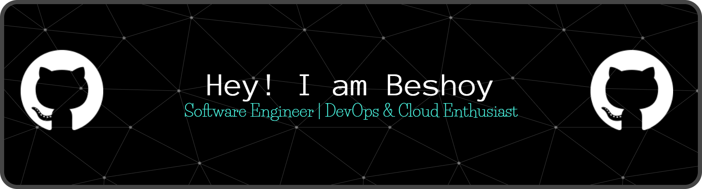

  

I build solid, production-ready systems with a focus on the business management space (BMS). My work combines practical system design with modern web tooling and emerging DevOps practices to deliver applications that stay reliable under real operational load.
---

## 🚀 Featured Projects

### 🔹 **BMS – Business Management System**
Production-ready business suite with:
- SQL Server backend  
- High-quality thermal printing  
- Multi-branch WAN/LAN synchronization  
- Optimized workflows for retail & operations

---

### 🔹 **DivePro System**
A tailored management system for diving centers:
- Customer & trip management  
- Equipment tracking & billing  
- Role-based access  
- Smooth multi-branch handling

---

### 🔹 **Qasr El Khdewy System**
A specialized business platform built for Qasr El Khdewy:
- Inventory, invoicing & reporting  
- Workflow automation  
- Fast, polished UI/UX  
- Reliable performance under daily business load

---

### 🔹 **Android NVR Server**
Transforms an Android device into a full-stack surveillance NVR:
- RTSP recording & live streaming  
- Human/motion detection  
- Continuous storage with automatic rotation  
- Modern web UI with calendar view + timeline playback  
- Built using Ubuntu (Termux), Python, FFmpeg & custom backend

---

## 🛠️ Tech Stack

**Core Skills**  
Application architecture, UI/UX design, real-time systems, automation workflows

**Programming**  
Python, C++, JavaScript

**Frameworks & Tools**  
Qt, PySide6, React, Node.js, Vite, Express, Figma

**Databases**  
SQL Server, SQLite

**DevOps & Infrastructure**  
Docker, Docker Compose, basic CI/CD pipelines, containerized services,  
reverse proxies, service monitoring, self-hosted deployments

**Networking Concepts**  
Sockets, local network communication, distributed data flows

---

## 🎯 Current Focus
- Building containerized real-time systems  
- Improving DevOps workflow for deployment & automation  
- Evolving UI/UX across all projects  
- Enhancing performance for multi-branch business apps  

---

## 📫 Contact
**Portfolio:** [beshoyriad.site](https://beshoyriad.site/)  
**Email:** [beshoy.riad@outlook.com](mailto:beshoy.riad@outlook.com)  
**LinkedIn:** [linkedin.com/in/beshoy-riad](https://www.linkedin.com/in/beshoy-riad/)
